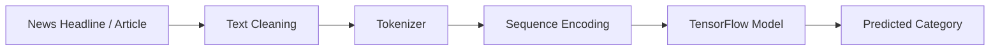

# 📰 BBC News Article Classifier

> **A deep learning–based Natural Language Processing (NLP) application that automatically classifies BBC news articles into predefined categories using TensorFlow and Keras.**

<p align="center">


</p>

---

# 📖 Overview

**BBC News Article Classifier** is a Natural Language Processing (NLP) application that automatically predicts the category of a news article based on its headline or textual content.

The project applies **Deep Learning** techniques using **TensorFlow** and **Keras** to learn language patterns from labeled BBC news data. A trained neural network processes input text, converts it into numerical representations through tokenization, and predicts the most likely news category.

An interactive web interface enables users to enter news text and receive real-time classification results.

---

# 🎯 Objectives

* Automate news categorization using AI.
* Demonstrate practical NLP and deep learning techniques.
* Build an interactive text classification application.
* Showcase machine learning model deployment.

---

# ✨ Key Features

* 📰 Automatic news category prediction
* 🧠 Deep learning–based text classification
* 🔤 Text preprocessing and tokenization
* ⚡ Real-time prediction through a web interface
* 💾 Pre-trained TensorFlow/Keras model
* 📚 Saved tokenizer for consistent preprocessing
* 🖥 Interactive application for testing news headlines

---

# 🏗 System Architecture



---

# 🔄 Prediction Pipeline

```text
User Input
     │
     ▼
Text Preprocessing
     │
     ▼
Tokenization
     │
     ▼
Sequence Padding
     │
     ▼
Deep Learning Model
     │
     ▼
Category Prediction
```

---

# 🛠 Technology Stack

| Category             | Technology                        |
| -------------------- | --------------------------------- |
| Programming Language | Python                            |
| Deep Learning        | TensorFlow                        |
| Neural Networks      | Keras                             |
| NLP                  | Tokenization & Text Preprocessing |
| Web Interface        | Streamlit                         |
| Data Serialization   | Pickle                            |

---

# 🧠 Machine Learning Pipeline

The application follows a standard NLP workflow:

1. Text cleaning and normalization
2. Tokenization
3. Sequence encoding
4. Padding sequences
5. Neural network inference
6. News category prediction

---

# 📂 Project Structure

```text
BBC_headline_detector/

├── app.py                                  # Streamlit application
├── BBc_Heading_detector_using_multiclassifiction.ipynb
├── news_classifier.keras                   # Trained Keras model
├── news_classifier.h5
├── news_category_classifier.h5
├── text_classifier.h5
├── tokenizer.pkl                           # Saved tokenizer
├── news_tokenizer.pkl
└── README.md
```

---

# 🚀 Installation

Clone the repository

```bash
git clone https://github.com/sajidrehman2/BBC-News-Article-Classifier.git

cd BBC-News-Article-Classifier
```

Create a virtual environment

```bash
python -m venv venv
```

Activate it

**Windows**

```bash
venv\Scripts\activate
```

**Linux/macOS**

```bash
source venv/bin/activate
```

Install dependencies

```bash
pip install -r requirements.txt
```

---

# ▶ Running the Application

Start the application

```bash
streamlit run app.py
```

Then open

```text
http://localhost:8501
```

---

# 📋 Example

### Input

```text
Scientists discover a breakthrough renewable energy technology that significantly reduces carbon emissions.
```

### Output

```text
Predicted Category:
Science / Technology
```

> *The exact category depends on the labels used during model training.*

---

# 📊 Applications

* News recommendation systems
* Digital journalism platforms
* Content management systems
* Media monitoring
* News aggregation
* AI-powered search engines
* Educational NLP projects

---

# 🚧 Future Improvements

* Support full news articles
* Transformer-based models (BERT, DistilBERT)
* Confidence score visualization
* Multi-language classification
* REST API with FastAPI
* Docker deployment
* Cloud deployment
* Explainable AI (XAI) for predictions

---

# 🤝 Contributing

Contributions are welcome.

Feel free to fork the repository, improve the project, and submit pull requests.

---

# 👨‍💻 Author

**Sajid Rehman**

**AI & Data Science Engineer**

Areas of Interest:

* Natural Language Processing (NLP)
* Machine Learning
* Deep Learning
* Large Language Models (LLMs)
* TensorFlow
* Python Development
* Artificial Intelligence

GitHub: **https://github.com/sajidrehman2**

---

# ⭐ Support

If you found this project useful, consider giving it a **Star ⭐** to support future development and help others discover the project.

---

# 📜 License

This project is licensed under the **MIT License**.

---

<p align="center">

**Transforming unstructured text into actionable insights with Deep Learning and Natural Language Processing.**

</p>
